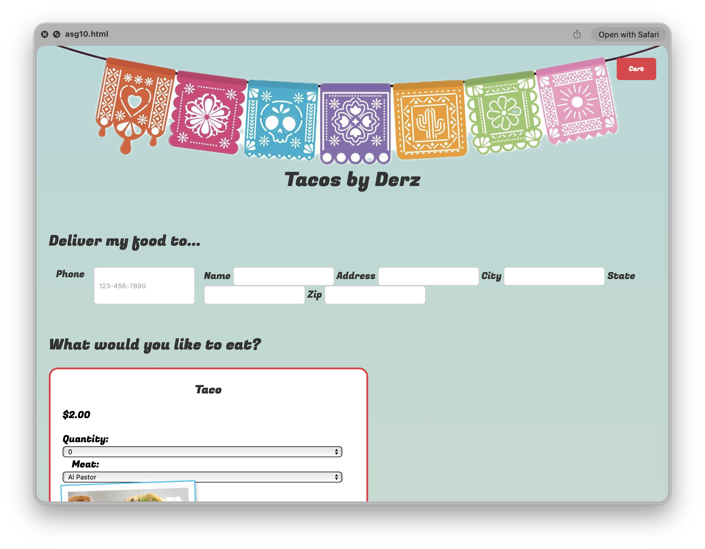
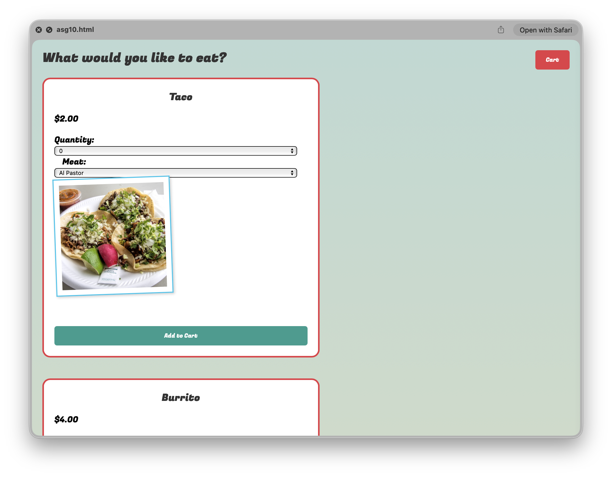
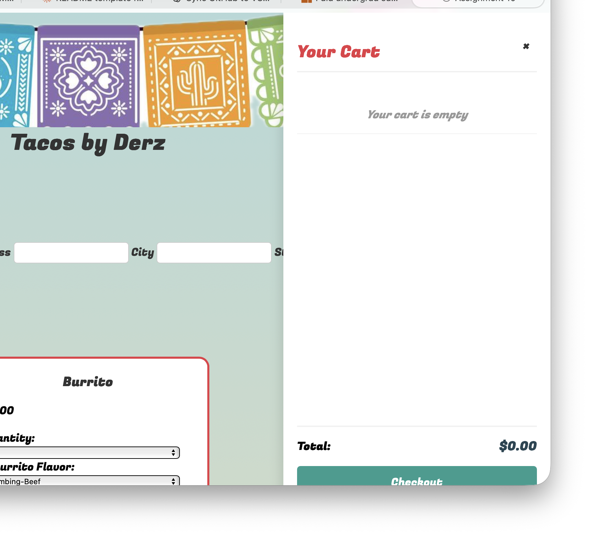

# Tacos by Derz

**Tacos by Derz** is a web-based food ordering application that allows customers to browse a Mexican food menu, customize their orders, and place delivery requests. The app features a dynamic shopping cart, real-time order management, and persistent customer data storage.

> _This project was created as part of **COSC 2328 (Spring 2025)** at **St. Edward's University**._


## Overview

**Tacos by Derz** provides a seamless online ordering experience for a fictional taco restaurant. Users can select from various menu items, customize their selections, add items to a shopping cart, and submit orders with delivery information. The application uses a MySQL database to store customer information and order details, creating a complete order management system.


## Features

- **Dynamic Menu**
  - Browse 4 main menu items: Tacos, Burritos, Nachos, and Drinks
  - Each item includes customization options (meat types, flavors, add-ons)
  - Quantity selection up to 10 items per order
  - Visual presentation with food photography

- **Interactive Shopping Cart**
  - Side panel cart that slides in from the right
  - Real-time cart updates with item count badge
  - View all items with details (type, add-ons, quantity, subtotal)
  - Remove individual items from cart
  - Live total calculation

- **Customer Management**
  - Form validation for delivery information
  - Automatic customer lookup by phone number
  - Returns existing customer data when phone number is recognized
  - Updates customer information on subsequent orders

- **Order Processing**
  - Database-backed order management
  - Transaction support for data integrity
  - Order confirmation with unique order ID
  - Detailed order summary display

- **User Experience**
  - Form clearing functionality
  - Responsive design for various screen sizes
  - Trendy Polaroid-style photo presentation for menu items


## Screenshots

<p align="center">
  
  
  
</p>

## How to Run

### Prerequisites
- **XAMPP** or similar local server environment (Apache + MySQL)
- Web browser (Chrome, Firefox, Safari, etc.)
- MySQL database access

### Setup Instructions

1. **Clone this repository**
   ```bash
   git clone [repository-url]
   cd tacos-by-derz
   ```

2. **Database Setup**
   - Start Apache and MySQL in XAMPP
   - Create a database named `cosc2328_asg10`
   - Import the provided SQL schema (if available) or create tables:
     - `customers` - stores customer delivery information
     - `orders` - stores order headers
     - `menu_items` - stores available menu items
     - `order_items` - stores individual items per order
     - `item_options` - stores customization choices
     - `addons` - stores available add-ons
     - `item_addons` - links add-ons to order items

3. **Configure Database Connection**
   - Update `asg10_php.php` with your database credentials:
     ```php
     $host = 'localhost';
     $dbname = 'cosc2328_asg10';
     $username = 'your_username';
     $password = 'your_password';
     ```

4. **Run the Application**
   - Place files in your XAMPP `htdocs` directory
   - Navigate to `http://localhost/[folder-name]/asg10.html`
   - Start ordering!


## Tech Stack

- **Frontend:**
  - HTML5
  - CSS3 (Custom styling with Google Fonts)
  - Vanilla JavaScript (ES6+)

- **Backend:**
  - PHP 7.4+
  - PDO for database access

- **Database:**
  - MySQL/MariaDB

- **Design:**
  - Custom gradient backgrounds
  - Google Fonts (Fugaz One, Inter)
  - Responsive flexbox layouts


## Project Structure

```
tacos-by-derz/
├── asg10.html              # Main HTML page
├── asg10_php.php           # Backend order processing
├── css/
│   └── asg10-css.css       # Stylesheet
├── js/
│   └── asg10-js.js         # Client-side functionality
└── images/
    ├── banner-pattern.jpg  # Header background
    ├── taco.jpg
    ├── burrito.jpg
    ├── nachos.jpg
    └── drink.jpg
```


## Key Features Implementation

### Cart System
- Client-side cart management using JavaScript arrays
- Dynamic DOM manipulation for cart updates
- Persistent cart state during session

### Form Handling
- Phone number validation with pattern matching
- Asynchronous customer lookup via fetch API
- Form data serialization for order submission

### Database Integration
- Prepared statements for SQL injection prevention
- Transaction support for atomic operations
- Normalized database schema with relational integrity


## What I Learned

- Building a complete full-stack web application from scratch
- Implementing CRUD operations with PHP and MySQL
- Creating dynamic user interfaces with vanilla JavaScript
- Managing application state without frameworks
- Handling asynchronous operations and API calls
- Designing responsive layouts with CSS Flexbox
- Working with forms, validation, and user input
- Database normalization and relational design


## Notes

This project was built for academic purposes as part of Assignment 10 for COSC 2328. The application demonstrates full-stack web development principles including frontend interactivity, backend processing, and database management. The restaurant "Tacos by Derz" is fictional and created for educational purposes only.
